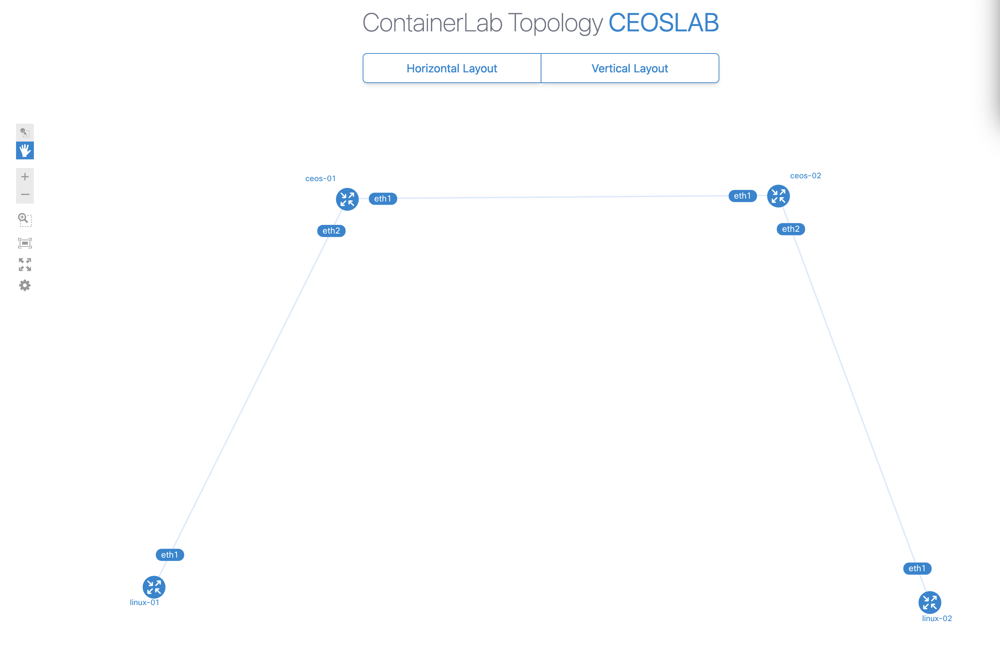

# Network Lab Environment Setup Guide

## Prerequisites

1. Clone the repository:
```bash
git clone git@github.com:kiraum/madlabs.git
```

## Mac ARM/Apple Silicon Setup
If you're using a Mac with ARM architecture (M1/M2), set up Colima first:

1. Install Colima:
```bash
brew install colima
```

2. Create the environment:
### ARM (if we don't set the desired arch, it will use the current one)
```bash
colima start --memory 8 --cpu 4
```
### this was the best one so far for my use case
```bash
colima start --arch x86_64 --memory 8 --cpu 4 --cpu-type Skylake-Server-v1,+ssse3
```
### list cpu-types
```bash
qemu-system-x86_64 -cpu help
```

3. Import cEOS image:
### For 32-bit (recommended):
```bash
xz -d cEOS-lab-4.33.0F.tar.xz
docker import cEOS-lab-4.33.0F.tar ceos:4.33.0F
```

### For 64-bit (recommended):
```bash
xz -d cEOS64-lab-4.33.0F.tar.xz
docker import cEOS64-lab-4.33.0F.tar ceos:4.33.0F
```

## Environment Setup
1. Start the environment:
```bash
docker-compose up -d
docker-compose exec containerlab bash
```

## Lab Operations
1. Navigate to quickstart lab:
```bash
cd labs/clab-quickstart
```

2. Deploy the lab:
```bash
containerlab deploy -t ceoslab.clab.yml
```

3. Inspect running containers:
```bash
# containerlab inspect -t ceoslab.clab.yml
INFO[0000] Parsing & checking topology file: ceoslab.clab.yml
╭──────────┬─────────────────────────────────┬─────────┬────────────────╮
│   Name   │            Kind/Image           │  State  │ IPv4/6 Address │
├──────────┼─────────────────────────────────┼─────────┼────────────────┤
│ ceos-01  │ ceos                            │ running │ 172.20.20.4    │
│          │ ceos:4.33.0F                    │         │ N/A            │
├──────────┼─────────────────────────────────┼─────────┼────────────────┤
│ ceos-02  │ ceos                            │ running │ 172.20.20.5    │
│          │ ceos:4.33.0F                    │         │ N/A            │
├──────────┼─────────────────────────────────┼─────────┼────────────────┤
│ linux-01 │ linux                           │ running │ 172.20.20.3    │
│          │ ghcr.io/hellt/network-multitool │         │ N/A            │
├──────────┼─────────────────────────────────┼─────────┼────────────────┤
│ linux-02 │ linux                           │ running │ 172.20.20.2    │
│          │ ghcr.io/hellt/network-multitool │         │ N/A            │
╰──────────┴─────────────────────────────────┴─────────┴────────────────╯
```

4. Access devices:
Default SSH access:
```bash
ssh admin@ceos-01
```

### If you face panic or need to restart the lab:
```bash
containerlab deploy -t ceoslab.clab.yml -c
```

## Device Access Examples
### Arista cEOS

* CLI access:
```bash
docker exec -it ceos-01 Cli
```

* Bash access:
```bash
docker exec -it ceos-01 bash
```

### Nokia SR Linux

* CLI access:
```bash
docker exec -it srl-01 sr_cli
```

* Bash access:
```bash
docker exec -it srl-01 bash
```

## Cleanup
To destroy the lab environment:
```bash
containerlab destroy -t ceoslab.clab.yml
```
And to cleanup:
```bash
containerlab destroy -t ceoslab.clab.yml --cleanup
```

## Enjoy
```bash
# ssh admin@ceos-01
Warning: Permanently added 'ceos-01' (ED25519) to the list of known hosts.
(admin@ceos-01) Password:
Last login: Sun Dec  8 20:59:51 2024 from 172.20.20.1
ceos>
ceos>
ceos>show version
Arista cEOSLab
Hardware version:
Serial number:
Hardware MAC address: 001c.732d.19a0
System MAC address: 001c.732d.19a0

Software image version: 4.33.0F-39050855.4330F (engineering build)
Architecture: i686
Internal build version: 4.33.0F-39050855.4330F
Internal build ID: ff38b52c-4b4f-4a3f-b591-ef310b5ac8ca
Image format version: 1.0
Image optimization: None

Kernel version: 6.8.0-47-generic

Uptime: 6 minutes
Total memory: 8125764 kB
Free memory: 6657088 kB
```

if you want to check your topology:
```bash
# containerlab graph -t ceoslab.clab.yml
WARN[0000] Attribute "ipv4_subnet" is deprecated and will be removed in the future. Change it to "ipv4-subnet"
INFO[0000] Parsing & checking topology file: ceoslab.clab.yml
INFO[0000] Serving topology graph on http://0.0.0.0:50080
```

Open a browser and navigate to http://0.0.0.0:50080:


## Script usage examples
```bash
# python3 scripts/mgmt.py
usage: mgmt.py [-h] {deploy,info} ...

positional arguments:
  {deploy,info}  Commands
    deploy       Deploy configuration
    info         Get device information

options:
  -h, --help     show this help message and exit
```

### get facts
```bash
# python3 scripts/mgmt.py info --limit ceos-01
get_device_info*****************************************************************
* ceos-01 ** changed : False ***************************************************
vvvv get_device_info ** changed : False vvvvvvvvvvvvvvvvvvvvvvvvvvvvvvvvvvvvvvvv INFO
---- Getting info from ceos-01 ** changed : False ------------------------------ INFO
{ 'facts': { 'fqdn': 'ceos-01',
             'hostname': 'ceos-01',
             'interface_list': ['Ethernet1', 'Ethernet2', 'Management0'],
             'model': 'cEOSLab',
             'os_version': '4.33.0F-39050855.4330F',
             'serial_number': '',
             'uptime': 5461.910061120987,
             'vendor': 'Arista'},
  'interfaces': { 'Ethernet1': { 'description': 'test69',
                                 'is_enabled': True,
                                 'is_up': True,
                                 'last_flapped': 1733867941.7668226,
                                 'mac_address': 'AA:C1:AB:C6:B9:14',
                                 'mtu': 9194,
                                 'speed': 1000.0},
                  'Ethernet2': { 'description': '',
                                 'is_enabled': True,
                                 'is_up': True,
                                 'last_flapped': 1733867941.752524,
                                 'mac_address': 'AA:C1:AB:44:88:37',
                                 'mtu': 9194,
                                 'speed': 1000.0},
                  'Management0': { 'description': '',
                                   'is_enabled': True,
                                   'is_up': True,
                                   'last_flapped': 1733867834.1633537,
                                   'mac_address': '02:42:AC:14:14:04',
                                   'mtu': 1500,
                                   'speed': 1000.0}}}
^^^^ END get_device_info ^^^^^^^^^^^^^^^^^^^^^^^^^^^^^^^^^^^^^^^^^^^^^^^^^^^^^^^
```

### deploy config (-c to deploy, without only diff)
```bash
# python3 scripts/mgmt.py deploy --limit ceos-0* -c
deploy_network******************************************************************
* ceos-01 ** changed : True ****************************************************
vvvv deploy_network ** changed : False vvvvvvvvvvvvvvvvvvvvvvvvvvvvvvvvvvvvvvvvv INFO
---- Configuring (replace) ceos-01! ** changed : True -------------------------- INFO
interface Ethernet1
-   description test3
+   description test69
^^^^ END deploy_network ^^^^^^^^^^^^^^^^^^^^^^^^^^^^^^^^^^^^^^^^^^^^^^^^^^^^^^^^
* ceos-02 ** changed : False ***************************************************
vvvv deploy_network ** changed : False vvvvvvvvvvvvvvvvvvvvvvvvvvvvvvvvvvvvvvvvv INFO
---- Configuring (replace) ceos-02! ** changed : False ------------------------- INFO
^^^^ END deploy_network ^^^^^^^^^^^^^^^^^^^^^^^^^^^^^^^^^^^^^^^^^^^^^^^^^^^^^^^^
```